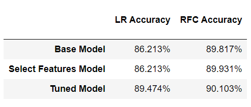

# Machine Learning: Exoplanet Exploration

## Background
Over a period of nine years in deep space, the NASA Kepler space telescope has been out on a planet-hunting mission to discover hidden planets outside of our solar system.

This project uses the data they gathered to train two machine learning (ML) models that are intended to classify candidate exoplanets. 

## Models
### Two Techniques
- Logistic Regression (LR)
- Random Forest Classifier (RFC)

### Model Design Approach
- Build a base model using the original dataset and all its 40 features.
- Use the base model to evaluate feature importance, and filter the data to include relevant features only.
- Build a second model (select features model) using the filtered data.
- Tune the model parameters using *GridSearchCV*.
- Build the final model using the tuned parameters. 

## Model Comparison
The RFC model was the more accurate of the two by a small margin.

## Conclusions
Evidently, given the relatively high accuracy of the RFC model, I believe it to be a reasonable predictor of exoplanet candidacy. However, a model leveraging deep learning techniques might prove superior.
